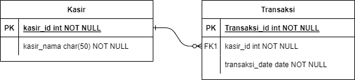

# Writing and Presentation Test 24-28 september
### **Web server & REST API**

- **Web server** adalah perangkat untuk memproses permintaan data, atau informasi yang pengguna masukkan lewat web browser

	cara kerja
	- Ketika pengguna web ingin mengakses konten website, browser akan meminta akses melalui internet, yang disebut HTTP request. browser mencari alamat IP website yang diminta dengan menerjemahkan URL halaman web melalui Domain Name System (DNS) atau pencarian dalam cache. Proses ini akan menemukan web server yang menghosting file website tersebut.

	- Web server menerima permintaan HTTP, lalu memprosesnya melalui server HTTP.
	Begitu permintaan diterima, server HTTP ini akan menelusuri file server untuk mengambil data yang relevan.

	- Setelah itu, web server mengembalikan hasil dalam bentuk file website ke browser yang tadi mengirimkan permintaan. Kemudian, pengguna pun bisa melihat konten website.

- Web server **statis** terdiri dari komputer dan software HTTP. Web server jenis ini mengirim kembali file website ke browser tanpa adanya perubahan.

- web server **dinamis** terdiri dari web server statis, dengan software tambahan yang biasanya terdiri dari database dan server application. Web server dinamis berfungsi untuk memperbarui file yang dihosting sebelum mengirimkannya melalui server HTTP. Dengan begini, web server dinamis bisa menghasilkan dan mengirim konten dinamis ke browser web.

- **REST API** adalah antarmuka yang digunakan oleh dua sistem komputer untuk bertukar informasi secara aman melalui internet. Sebagian besar application bisnis harus berkomunikasi dengan application internal dan pihak ketiga lainnya untuk melakukan berbagai tugas.

### **Node.js**

- **Node.js** adalah software open-source yang bisa digunakan untuk membuat application jaringan dan application server-side yang real-time dan scalable (bisa dikembangkan sesuai kebutuhan). Pada dasarnya, Node.js adalah runtime environment lintas platform single-thread yang dibangun berdasarkan engine JavaScript V8 Chrome.

- Node.js menggunakan arsitektur “Single Threaded Event Loop” untuk menangani beberapa client secara bersamaan. Model pemrosesan Node.js didasarkan pada model event-based JavaScript dan mekanisme callback JavaScript.

- cara kerja
	- Client mengirim request ke webserver untuk berinteraksi dengan application web. Request dapat berupa blocking atau non-blocking, misalnya: meminta, menghapus, dan memperbarui data.
	- Node.js mengambil request yang masuk, kemudian menambahkannya ke Event Queue.
	- Permintaan kemudian diteruskan satu per satu melalui Event Loop dan diperiksa apakah requestnya cukup sederhana sehingga tidak memerlukan resource eksternal apapun.
	- Event Loop memproses permintaan sederhana (operasi non-blocking), seperti Polling I/O, dan mengembalikan respons ke client terkait.
	- Satu thread dari Thread Pool ditugaskan ke satu request yang kompleks. Thread ini bertanggung jawab untuk menyelesaikan permintaan blocking tertentu dengan mengakses eksternal resource, seperti komputasi, database, sistem file, dan sebagainya.
	- Setelah task selesai dilakukan, respons dikirim ke Event Loop yang pada gilirannya untuk mengirimkan respons itu kembali ke client.

- Modul ```node:console``` menyediakan console debugging sederhana yang mirip dengan mekanisme console JavaScript yang disediakan oleh browser web.
	```
	console.log("Hello world!");
	```
- ```process``` adalah module yang digunakan untuk menampilkan dan mengontrol prosess Node JS yang sedang dijalankan.
	```
	const process = rquire('process');
	const env =process.env;
	env.foo = 'bar';
	console.log(env.foo);
	```
- Modul ```node:os``` menyediakan  methods and properties terkait sistem operasi
	```
	const os = require('node:os');
	```
- Modul ```node:util``` mendukung kebutuhan API internal Node.js. 
	```
	const util = require('node:util');
	```
- Node.js memiliki built-in module, yang disebut "Events"
Untuk menyertakan modul Events bawaan, gunakan ```require() ```method. Selain itu, semua properties and methods Events adalah turunan dari object EventEmitter.
	```
	var events = require('events');
	var eventEmitter = new events.EventEmitter();

	//Create an event handler:
	var myEventHandler = function () {
	console.log('I hear a scream!');
	}

	//Assign the event handler to an event:
	eventEmitter.on('scream', myEventHandler);

	//Fire the 'scream' event:
	eventEmitter.emit('scream');
	```
- Errors merupakan module yang dapat digunakan untuk mendefinisikan error di Node JS sehingga bisa dimengerti. 
	```
	// Throws with a ReferenceError because z is not defined.
	try {
	const m = 1;
	const n = m + z;
	} catch (err) {
	// Handle the error here.
	}
	```
- Node.js memungkinkan pengembang untuk menggunakan JavaScript untuk menulis code back-end, meskipun secara tradisional digunakan di browser untuk menulis code front-end. Memiliki frontend dan backend bersama-sama seperti ini mengurangi upaya yang diperlukan untuk membuat server web, yang merupakan alasan utama mengapa Node.js adalah pilihan populer untuk menulis code back-end

- Membuat Server HTTP Dasar
	- memuat ```http``` modul yang standar dengan semua instalasi Node.js. 
	```
	const http = require("http");
	```
	- langkah selanjutnya adalah menentukan host dan port yang akan diikat oleh server kita:
	```
	const host = 'localhost';
	const port = 8000;
	```
	- membuat function
	```
	const myfunction = function (req, res) {
    res.writeHead(200);
    res.end("My first server!");
	};
	```
	- kita membuat server objek baru melalui fungsi ```http``` modul createServer(). 
	```
	const server = http.createServer(myfunction);
	server.listen(port, host, () => {
		console.log(`Server is running on http://${host}:${port}`);
	});
	```
### **Express JS**
- Routing  mengacu pada penentuan bagaimana application merespons client request ke endpoint tertentu, yang merupakan URI (atau jalur) dan HTTP request method tertentu (GET, POST, dan seterusnya).

- Setiap route dapat memiliki satu atau lebih handler functions, yang dijalankan ketika route dicocokkan.

- Definisi route  mengambil struktur berikut:
	```
	app.METHOD(PATH, HANDLER)
	```
	- ```app``` adalah contoh dari express.
	- ```METHOD``` adalah metode permintaan HTTP , dalam huruf kecil.
	- ```PATH``` adalah jalur di server.
	- ```HANDLER``` adalah function  yang dijalankan ketika route dicocokkan.
	contoh
	```
	app.get('/', (req, res) => {
		res.send('Hello World!')
	})
	```
- mengirim response berupa output json yang biasa dipakai untuk back end application. dengan menggunakan output json maka kita dapat mengirim data yang mudah diakses
	```
	app.get('/movie', (req, res) => {
		res.json({title: "sherlockholmes"})
	})
	```
- Objek ```res``` juga dapat menentukan kode status HTTP dengan .```status()``` method tersebut. Di index.jsfile Anda, integrasikan .status() method pada res objek dan teruskan kode status HTTP sebagai argumen:
	```
	res.status(404).send('Not Found');
	```
- ```req.query``` adalah request object yang diisi oleh query strings request yang ditemukan di URL. query strings ini dalam bentuk key-value. mulai setelah tanda tanya (?) di URL  dan jika ada lebih dari satu, dipisahkan dengan ampersand (&). 
	```
	app.get("/user", (req, res)=>{
	var name = req.query.name;
	var isAuthor = req.query.isAuthor;
	res.json({
		name,isAuthor
	})
	})
	```
- Express adalah kerangka web routing dan middleware yang memiliki fungsionalitas minimal sendiri: application Express pada dasarnya adalah serangkaian panggilan function middleware.

- function middleware adalah function yang memiliki akses ke request object  (req), object response (res), dan function middleware berikutnya dalam siklus request-response application. function middleware berikutnya biasanya dilambangkan dengan variabel bernama next.

- function middleware dapat melakukan tugas-tugas berikut:

	- Jalankan code apa pun.
	- membuat perubahan pada permintaan dan object response.
	- mengahiri siklus request-response.
	- memanggil object middleware berikutnya di tumpukan.

- Jika object middleware saat ini tidak mengakhiri siklus request-response, ia harus memanggil next() untuk meneruskan kontrol ke object middleware berikutnya. Jika tidak, permintaan akan dibiarkan menggantung.

- Express Application dapat menggunakan jenis middleware berikut:
	- Application-level middleware
		```
		app.use('/user/:id', (req, res, next) => {
		console.log('Request Type:', req.method)
		next()
		})
		```
		 function middleware yang dipasang di /user/:idjalur. function ini dijalankan untuk semua jenis HTTP request di /user/:idjalur.
	- Router-level middleware, 
	Middleware tingkat router bekerja dengan cara yang sama seperti middleware tingkat aplikasi, kecuali ia terikat pada instance express.Router().
		```
		const router = express.Router()
		```
	- Error-handling middleware, definisikan function middleware penanganan kesalahan dengan cara yang sama seperti function middleware lainnya, kecuali dengan empat argumen (err, req, res, next)):
		```
		app.use((err, req, res, next) => {
		console.error(err.stack)
		res.status(500).send('Something broke!')
		})
		```
	- Built-in middleware
		- express.static menyajikan aset statis seperti file HTML, gambar, dan sebagainya.
		- express.json mem-parsing permintaan masuk dengan muatan 
		- express.urlencoded mem-parsing permintaan masuk dengan muatan yang disandikan URL
	- Third-party middleware, gunakan middleware pihak ketiga untuk menambahkan fungsionalitas ke aplikasi Express.
		```
		$ npm install cookie-parser
		```
		```
		const express = require('express')
		const app = express()
		const cookieParser = require('cookie-parser')

		// load the cookie-parsing middleware
		app.use(cookieParser())
		```
### **Design Database With MySQL**

- **Entitas** merupakan sekumpulan objek yang dapat diidentifikasi secara unik dan berbeda satu dengan yang lainnya.
- pada dasarnya entitas dapat sebuah tabel, apabila ada daatabase bernama toko maka databse yag ada didalamnya adalah entitas kasir, transaksi, barang
- **Atribut** merupakan properti atau karakteristik yang mendeskripsikan sebuah entitas. contohnya, apabila terdapat entitas kasir maka atributnya kasir_id, kasir_nama
- **ERD** (Entity Relationship Diagram) atau diagram hubungan entitas adalah sebuah diagram yang digunakan untuk perancangan suatu database dan menunjukan relasi atau hubungan antar objek atau entitas beserta atribut-atributnya secara detail. 



dalam erd diatas terdapat entitas kasir dan transaksi, tabel kasir memiliki primary key kasir_id, dan berelasi dengan tabel transaksi, kasir_id pada tabel trannsaksi menjadi foreign key. artinya setiap kasir memiliki banyak transaksi